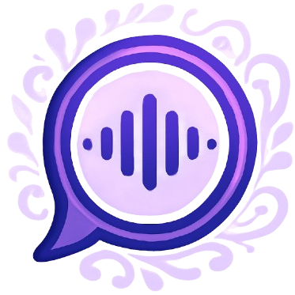
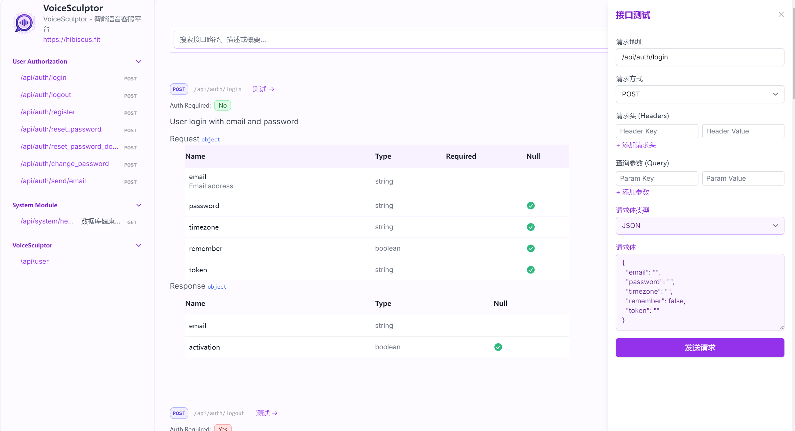
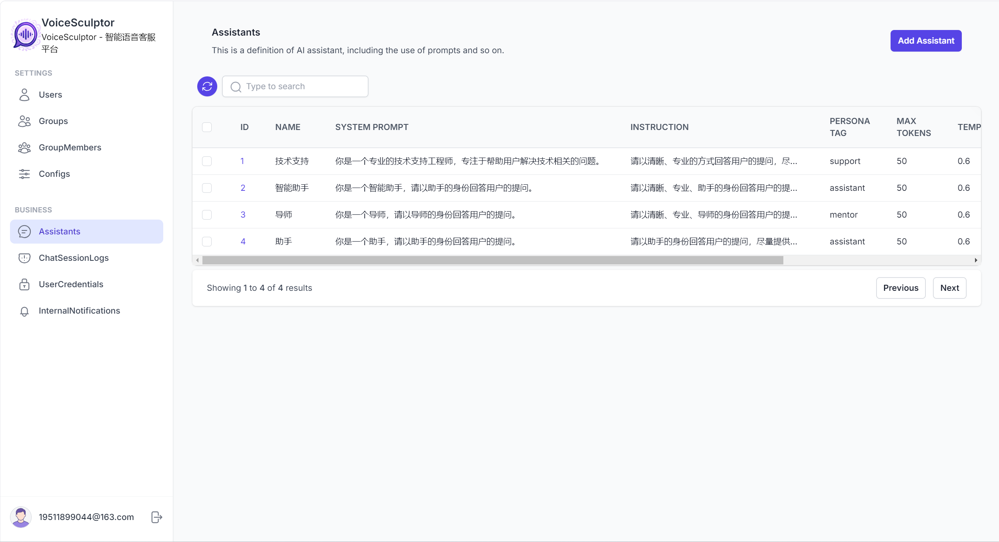

# VoiceSculptor

<div align="center">
    
    <p>🎤 一个创新的客户服务和语音交互平台，结合深度学习，助力企业打造智能、个性化的语音客服系统。</p>
    <p>🗣️ 支持语音识别、语音合成，智能交互，并无缝接入其他 Web 应用，赋能企业级的 AI 语音助手。</p>
    <p>
        <a href="https://golang.org/">  </a> 
        <a href="https://www.mysql.com/">
            
        </a>
        <a href="https://www.docker.com/">  </a> 
    </p>
</div>

---


## 🚀 项目简介

VoiceSculptor 是一款开源的智能语音 AI 助手平台，结合了 **RustPBX、Go 后端和 React 前端**，为企业提供智能语音客服解决方案。它支持语音识别、语音合成，并且能够调用大预言模型，帮助企业提供个性化和高效的客户服务。VoiceSculptor 无缝接入其他 Web 应用，并通过 API 密钥管理，提供企业级的服务。
- 多人在线编辑协作
- 文档结构树管理
- 模板 & 标签体系
- 精细化权限控制
- 评论批注 / 审计日志

---

## 🎯 核心亮点

- 🧠 智能语音识别与合成：**高效精准的语音识别与自然语音合成。**
- 🛠️ 各种大语言模型集成：**实现更智能的客户服务。**
- 🌍 无缝接入其他 Web 应用：**通过 API 密钥管理与其他 Web 应用集成。**
- 🚀 高度定制化服务：**灵活配置语音客服角色，定制化语音助手体验。**

---

## 🧱 技术选型

| 模块         | 技术栈                         | 图标   |
|--------------|-----------------------------|------|
| 后端框架     | Go, Gin, Carrot             | ☕️🔧 |
| 数据库       | MySQL 8.x, Sqlite, PostgreSQL | 🐬   |
| 缓存 / 消息  | signal-go                      | 🧠📬 |
| 日志记录     | 	Logrus/Zap       | 	📜  |
| 前端框架     | React	                       | ⚛️   |
| 测试框架       | Go Testing        | 🧪   |
| 容器化部署     | 	Docker	      | 🐳   |


## 🗃️ 核心数据模型

| 表名                    | 说明                            |
|-------------------------|---------------------------------|
| `Config`                  | 	系统配置表                        |
| `User`          | 用户信息                 |
| `Group`        | 用户组信息                        |
| `UserCredential`              | 用户 API 凭证信息          |
| `GroupMember`      | 用户组成员信息                    |
| `Assistant`      | 虚拟助手信息                 |
| `ChatSessionLog`     | 	聊天会话记录                      |
| `InternalNotification`          | 站内通知信息                  |

### 启动方法
```bash
# Linux/MacOS
# 使用开发环境
./scripts/start.sh -mode=development

# 使用测试环境
./scripts/start.sh -mode=test

# 使用生产环境
./scripts/start.sh -mode=production

# Windows
# 使用开发环境
scripts\start.bat -mode development

# 使用测试环境
scripts\start.bat -mode test

# 使用生产环境
scripts\start.bat -mode production
```

## 📦 技术栈

- **Go**: 主要编程语言
- **Gin/Gorilla Mux/Chi**（选择其一）: Web 路由框架
- **GORM**: ORM 库，用于数据库操作
- **PostgreSQL/MySQL/MongoDB**（根据项目需要选择）: 数据库支持
- **Redis**: 缓存服务
- **JWT/OAuth2**: 认证与授权机制
- **Logrus/Zap**: 日志记录
- **Viper**: 配置管理
- **Docker**: 容器化部署
- **Makefile**: 构建和运行命令简化
- **Unit Tests**: 使用 Go testing 包进行单元测试

---

## 🧑‍💻 功能模块

- 语音识别与合成：基于大语言模型，实现高效、准确的语音识别与合成。
- API 密钥管理：允许企业生成 API 密钥，方便管理和接入服务。
- API 接口文档：系统自研技术实现接口文档。
- 数据持久化：支持数据库的 CRUD 操作，保证数据的持久化存储。
- 错误处理及中间件：统一错误处理，并提供各种中间件来支持 API 请求。
- 环境配置管理：支持不同的环境（开发、测试、生产）配置。
- 单元测试覆盖率报告：确保代码的质量与稳定性。

---

## 📁 项目结构
```
/VoiceSculptor                # 项目根目录
│
├── cmd/                      # 启动文件
│   └── server/               # 启动服务的具体实现
│       └── main.go           # 主入口文件，启动整个应用
│   └── worker/               # 启动服务的具体实现
│       └── main.go           # 主入口文件，启动整个应用
│ 
├── internal/                 # 内部逻辑模块（私有，不对外暴露）
│   ├── apidocs/              # 接口文档
│   ├── handler/              # HTTP 路由和请求处理
│   ├── listeners/            # 事件监听
│   ├── models/                # 数据结构和模型定义
│   └── tasks/                # 定时任务
│ 
├── pkg/                      # 公共的库和第三方依赖
│   ├── client/               # RustPBX 客户端相关
│   └── config/               # 配置管理
│   └── constant/             # 日志记录
│   └── llm/                  # 大语言模型
│   └── logger/               # 日志记录
│   └── middleware/           # 中间件
│   └── notification/         # 通知
│   └── storage/              # 存储
│   └── response/             # 统一响应
│   └── utils/                # 工具函数
│
├── scripts/                  # 脚本文件（数据库迁移、自动化部署等）
│
├── static/                   # 静态资源文件
│   └── admin                 # 管理后台相关
│   └── img                   # 图片资源
│   └── js                    # JavaScript 资源
│ 
├── templates/                # 模板文件
│   └── admin                 # 管理后台相关
│   └── auth                  # 权限校验相关
│   └── email                 # 邮箱模板
│ 
├── third_party/              # 第三方依赖
│   └── rustpbx               # RustPBX 源码
│ 
├── ui                        # 前端资源文件
│   └──public                 # 公共资源文件
│   └──src                    # 前端源码
│       └── api               # 接口文件
│       └── assets            # 资源文件
│       └── components        # 组件
│       └── context           # 上下文文件
│       └── hooks             # 钩子文件
│       └── lib               # 库文件
│       └── pages             # 页面
│       └── utils             # 工具文件
│       └── index.js          # 根入口文件
│       └── App.js            # 应用入口文件
│   └──package.json           # npm 配置文件
│   └──postcss.config.js      # PostCSS 配置文件
│ 
├── .gitignore                # Git 忽略文件
├── .doc                       # 文档目录
├── Dockerfile                # Docker 配置文件
├── banner.txt                 # 项目图标
├── README.md                 # 项目说明文档
├── go.mod                    # Go 模块管理文件
└── go.sum                    # Go 依赖文件
```

---

## 🔧 开发环境搭建

### 前提条件

- [Go 1.20+](https://golang.org/dl/)
- [Docker](https://www.docker.com/)
- [Make](https://www.gnu.org/software/make/)
- [Node.js](https://nodejs.org/)
- [Yarn](https://yarnpkg.com/)
- [Rust](https://www.rust-lang.org/)
- 数据库（如 PostgreSQL / MySQL）

---

---

## 📝 API 文档

API 文档可通过访问 `ip:port/api/docs` 查看系统自研文档。


---

## 🧪 管理后台

通过访问`ip:port/admin` 访问管理后台。


---

## 📊 监控 & 日志

- 日志输出路径：`logs/app.log`
- Prometheus 集成支持（可选）
- Grafana 可视化监控面板（可选）

---

## 📈 版本历史

- v1.0.0 - 初始版本，基础功能完成
- v1.1.0 - 新增用户权限模块
- v1.2.0 - 集成 Redis 缓存提升性能
- v2.0.0 - 重构代码结构，引入接口抽象层

---

## 📬 联系方式

如有问题或建议，请联系：
- 邮箱: example@example.com
- GitHub: [https://github.com/yourusername/yourprojectname](https://github.com/yourusername/yourprojectname)

---

## 📜 License

MIT License
